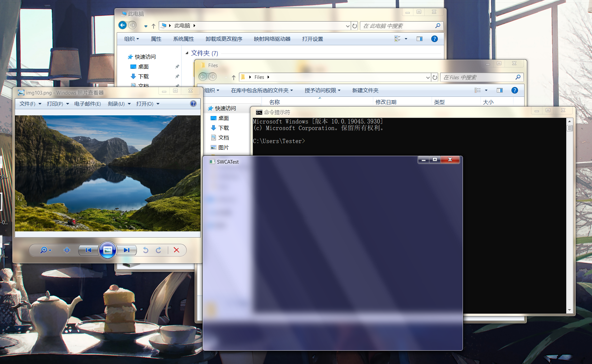

# DWMBlurGlass
Add custom effects to the global system title bar, supports Windows 10 and Windows 11.

给全局系统标题栏添加自定义效果，支持win10和win11
#
| [中文](/README_ZH.md) | [English](/README.md) | [italiano](/README_IT.md) | [français](/README_FR.md) | [Türkçe](/README_TR.md) | [español](/README_ES.md) | [German](/README_DE.md) 

This project uses [LGNU V3 license](/COPYING.LESSER).

## !!! Do not download DWMBlurGlass from anywhere else!!!!
> [!WARNING]
> We have discovered that someone is pretending to be us and posting DWMBlurGlass with a malicious code implant.
> 
> To avoid this kind of matter from happening again, please do not download the software from unofficial addresses!
> 
> **We also don't have any official Discord.**
> 
> We only distribute software on [Github](https://github.com/Maplespe/DWMBlurGlass/releases), [Bilibili](https://space.bilibili.com/87195798) and [winmoes](https://winmoes.com).
> 
> As well, any new versions for testing are pushed to the test branch first, rather than releasing binaries in advance.

  

## Catalog
- [Effects](#effects)
- [Compatibility](#compatibility)
- [Gallery](#gallery)
- [Material Effects](#material-effects)
  - [Blur](#blur)
  - [Aero](#aero)
  - [Acrylic](#acrylic)
  - [Mica](#mica)
  - [MicaAlt](#micaalt)
- [How to use](#how-to-use)
  - [Install](#install)
  - [Uninstall](#uninstall)
- [Language files](#language-files)
- [Dependencies](#dependencies)

## Effects
* Adds a custom effect to the global system title bar.
* Customizable global blur radius or title bar blur radius only.
* Customizable title bar blend colors.
* Customizable title bar text color.
* Aero reflections and parallax effects are available.
* Restore Windows 7 style titlebar button height.
* Restore Windows 7 style titlebar button glow.
* Support to enable blur effect for programs using old Windows 7 API DwmEnableBlurBehindWindow.
* Supports `Blur`, `Aero`, `Acrylic`, and `Mica (Win11 only)` effects.
* Individually customizable Light/Dark color mode automatic switching.
* `CustomBlur`, `AccentBlur` and `SystemBackdrop` blurring methods are available.
* Third-party theme support.

## Compatibility
Supported as low as **Windows 10 2004** and as high as the **latest version of Windows 11** (Some blurring methods are not supported in Windows Insider versions).

Can be used with third party themes to further customize DWM.

We do not modify the rendering logic of the application itself, which is completely different from the logic of MicaForEveryone and therefore maximizes compatibility with third-party programs.

We reverse-analyzed DWM and created a custom blur method to bring stunning visual effects, but if you choose the "`SystemBackdrop`" blur method, it uses the system's publicly available interfaces and has the same effect as MicaForEveryone.

Not recommended for use with MicaForEveryone, we do not guarantee compatibility with it.

Compatible with [ExplorerBlurMica](https://github.com/Maplespe/ExplorerBlurMica), works better together.

Compatible with [TranslucentFlyouts](https://github.com/ALTaleX531/TranslucentFlyouts). (**It should be noted that even though this project is compatible with TF, EBMv2 is not fully compatible with TFv2**)

## Gallery

<b>Windows 11</b>

  

- [x] Override DWMAPI mica effect (win11)

<b>Windows 10</b>

Using third-party themes

- [x] Extend effects to borders (win10)
- [x] Aero reflection effect
- [x] Restore Win7 style titlebar button size

## Material Effects
### Blur
> Basic pure blur. Nothing special.

### Aero
> Windows 7's glass effect, with saturation and exposure effects on the background when a window is inactive.

### Acrylic
> The acrylic recipe: background, blur, exclusion blend, saturation, color/tint overlay and noise.

### Mica
> The Mica recipe: blurred wallpaper, saturation and color/tint overlay.

### MicaAlt
All of the above effects can be customized to blend colors.

MicaAlt is Mica with a grayish tone, you can modify the blend color by yourself to get the MicaAlt effect.

## How to use

### Install
1. Download the compiled program archive from the [Release](https://github.com/Maplespe/DWMBlurGlass/releases) page.
2. Unzip it to a location such as "`C:\Program Files`".

<b>3. Run the DWMBlurGlass.exe GUI program and click Install.</b>

>If nothing happens when you click Install, then you need to click on the Symbols page and click Download.

>**You may receive a notification about missing symbols in the future, especially after system updates.**

### Uninstall
1. Run the DWMBlurGlass.exe GUI program and click Uninstall.
2. Delete relevant files

## Language files
We offer several languages, such as English, Simplified Chinese, Spanish, Portuguese and more.
If you would like to help us translate into other languages, please see below for language file formats.

1. First, you need to fork this repository and clone it locally.
2. Open the "`Languagefiles`" folder and select an existing language such as "`en-US.xml`" and make a copy.
3. Rename the code to the name of the [target language](https://learn.microsoft.com/en-us/windows/win32/intl/locale-names) and open the xml file in your favorite text editor.
4. In the second line, in the "`local`" field, change it to your target language code, which should be the same as the filename (without the .xml extension).
5. You can put your name in the "`author`" field.
6. Next, please translate the field values in the xml format (be careful not to translate the field names) The correct format is:`<config>Config</config>` to `<config>xxxx</config>`.
7. Save your file when finished and copy it to the "data\lang" directory in the folder where the DWMBlurGlass.exe program is located.
8. Next, open DWMBlurGlass.exe and test the language file to see if it works correctly. If it doesn't, check the language code settings and check that the file conforms to the xml format specification.
9. Finally, commit the file to your own forked repository and send a pull request to the main branch of the project.
10. After the request is approved, your file will be released with a future software update.
   

## Dependencies
* [MiaoUI Lite interface library v2](https://github.com/Maplespe/MiaoUILite)
* [AcrylicEverywhere](https://github.com/ALTaleX531/AcrylicEverywhere) - Separate upstream implementation of the CustomBlur method, thanks to ALTaleX for research and support.
* [minhook](https://github.com/m417z/minhook)
* [pugixml](https://github.com/zeux/pugixml)
* [VC_LTL](https://github.com/Chuyu-Team/VC-LTL5)
* [Windows Implementation Libraries](https://github.com/Microsoft/wil)

Since the GUI program uses private libraries, only insiders can compile the GUI, which does not affect the compilation of the libraries.
